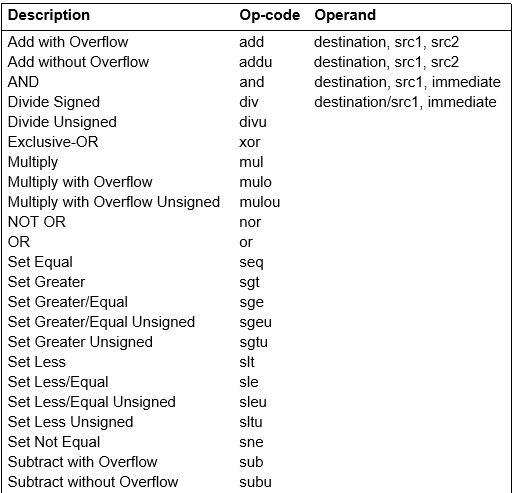
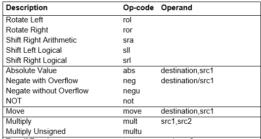

# MIPS


### Overview

- Assembly language 
    - The main body of assembly language is assembly instruction. Assembly instructions and machine instructions differ in instruction expression. Assembly instruction is a *human-friendly* writing format of machine instruction. Assembly language is the mnemonic(记忆的) of machine language. 

        - For example 

            machine instruction “1000100111011000” means that send the contents of register BX to AX. 

            The assembly instructions are written as “move ax, bx”. 

            Such writing is similar to human language and easy to read and remember. 

    - Feature：programs written in assembly language are inherently machine-specific and must be totally rewritten to run on another computer architecture 

    - CISC (intel x86) vs RISC (ARM , MIPS)


### Assembly Program Structure

- Program Structure 
    - data declarations
        - `.data`
    - program code
        - `.text` 
    - data declaration section followed by program code section 

- **Data** Declarations 
    - placed in section of program identified with assembler directive `.data` 
    - declare variable names used in program; storage allocated in main memory (RAM) 

- **Code** 
    - placed in section of text identified with assembler directive `.text`
    - contains program code (instructions) 
    - starting point for code e.g .ecution given label main: 
    - ending point of main code should use exit system call (see below in “System Calls” part) 

- Comments 
    - anything following # on a line 

        \# This stuff would be consideredd as comment


### **System Calls** 

| Service      | System call code | Arguments                                              | Result                      |
| ------------ | :--------------: | ------------------------------------------------------ | --------------------------- |
| Print_int    |        1         | $a0 = integer                                          |                             |
| Print_float  |        2         | $f12 = float                                           |                             |
| Print_double |        3         | $f12 = double                                          |                             |
| Print_string |        4         | $a0 = address of null-terminated string to print       |                             |
| Read_int     |        5         |                                                        | integer (in \$v0)           |
| Read_float   |        6         |                                                        | float (in \$f0)             |
| Read_double  |        7         |                                                        | double (in \$f0)            |
| Read_string  |        8         | $a0 = buffer, \$a1 = length                            |                             |
| sbrk         |        9         | $a0 = amount                                           | address (in \$v0)           |
| exit         |        10        |                                                        |                             |
| Print_char   |        11        | $a0 = char                                             |                             |
| Read_char    |        12        |                                                        | char (in \$v0)              |
| open         |        13        | $a0 = filename (string),  \$a1 = flags,  \$a2 = mode   | file descriptor (in \$v0)   |
| read         |        14        | $a0 = file descriptor,  \$a1 = buffer,  \$a2 = length  | num chars read (in \$v0)    |
| write        |        15        | \$a0 = file descriptor,  \$a1 = buffer,  \$a2 = length | num chars written (in \$v0) |
| close        |        16        | \$a0 = file descriptor                                 |                             |
| exit2        |        17        | \$a0 = result                                          |                             |


### Machine Language & Assembly Language

- **Machine instruction** ：a binary representation used for communication with a computer system. 

- **Assembly instruction**： a symbolic representation of machine language 

- **Assembler**: translate assembly codes into binary instructions


### Data Types and Literals

In **MIPS32** 

- Unit Conversion 
    - **1 word = 32bit = 2\*half word(2\*16bit) = 4\* byte(4\*8bit)** 

- Data Storage: 
    - Instructions are **all 32 bits**(1 word) 
    - A character requires **1 byte** of storage 

- Literals： 
    - Characters enclosed in single quotes. e.g. ‘C' 
    - Strings enclosed in double quotes. E.g. “a String” 
    - Numbers in code. e.g. 10


## Registers


### Introduction to registers

- **Registers** are small storage areas used to store data in the CPU, which are used to temporarily store the data and results involved in the operation. 
    - \$zero, \$at, \$v0~1, \$a0~3, \$t0~1
- All MIPS arithmetic instructions must operate on registers 
- The **size of registers** in MIPS32 is **32 bits**

| NAME          | NUMBER | USE                                                        | PRESERVED  ACROSS A CALL? |
| ------------- | :----: | ---------------------------------------------------------- | :-----------------------: |
| **\$zero**    |   0    | The Constant Value 0                                       |           N.A.            |
| **\$at**      |   1    | Assembler Temporary                                        |            No             |
| **\$v0~\$v1** |  2~3   | Values for Function Results<br/> and Expression Evaluation |            No             |
| **\$a0~\$a3** |  4~7   | Arguments                                                  |            No             |
| **\$t0~\$t7** |  8~15  | Temporaries                                                |            No             |
| **\$s0~\$s7** | 16~23  | Saved Temporaries                                          |         ***Yes***         |
| **\$t8~\$t9** | 24~25  | Temporaries                                                |            No             |
| **\$k0~\$k1** | 26~27  | Reserved for OS Kernel                                     |            No             |
| **\$gp**      |   28   | Global Pointer                                             |         ***Yes***         |
| **\$sp**      |   29   | Stack Pointer                                              |         ***Yes***         |
| **\$fp**      |   30   | Frame Pointer                                              |         ***Yes***         |
| **\$ra**      |   31   | Return Address                                             |            No             |


## Data


### Declaration

​		`name:		storeage_type	value`

```assembly
var1:		.word	3			# create a single integer:
								# variable with initial value 3

array1:		.byte	'a','b'		# create a 2-element character
								# array with elements initialized
								# to a and b

array2: 	.space	40			# allocate 40 consecutive bytes,
								# with storage unintialized(\0)
								# could be used as a 40-element
								# character array, or a 
								# 10-element integer array;
								# a comment should indicate it.

string1:	.asciiz "Print this\n"		# declare a string ends with \0

string2:	.ascii	"Print that\n"		# declare a string ends without \0
```


### Data Processing Details

- **Signed** vs **Unsigned**

    - **Signed** data uses its highest bit to represent its sign.

    - Bugs:

        - Unsigned number `0x71111111`, in binary `0111_0001_0001_…_0001_0001`.
- If we add it to itself using `addu`, without overflow detection, everything’s fine.
        - If we use `add` instead, exceptions are: `Runtime exception at ... arithmetic overflow` since the sign bit is taken.
    
- **Signed-extended** vs **Zero-extended**

    - **Extended**: when saving a signed number that is shorter than it declares, i.e.

        -  ```assembly
            tdata: .byte 0x80
            ...
            lb  $a0, tdata
            #or
            lbu $a0, tdata
            ```

        - `lb `: the higher bits in `$a0` are filled with the signed bit in `tdata`. Thus if it is minus it can uses its 2’s complement. 

            - $\bar{x} + 1 = -x$

        - `lbu`: the higher bits in `$a0` are filled with 0's.

- **Exception** while processing signed data

    - Exceptions happen when signed and unsigned numbers are confounded.

- **Big-endian** vs **Little-endian**

    - The CPU's **byte ordering scheme** (or **endian issues**) affects memory organization and defines the relationship between the address and the byte position of data in memory.

        - | Byte     | Byte 0  | Byte 1  | Byte 2 | Byte 3 |
            | -------- | ------- | ------- | ------ | ------ |
            | **Bits** | 31 … 24 | 23 … 16 | 15 … 8 | 7 … 0  |

            A **big-endian** system means byte 0 is always the most-significant (leftmost) byte. 

            | Byte     | Byte 3  | Byte 2  | Byte 1 | Byte 0 |
            | -------- | ------- | ------- | ------ | ------ |
            | **Bits** | 31 … 24 | 23 … 16 | 15 … 8 | 7 … 0  |

        - A **little-endian** system means byte 0 is always the least-significant (rightmost) byte.

    - Notice that they functions similarly when storing bytes one by one, but act differently when store a word at the same time.


## MIPS Instructions


### Load ( Load to Register)

```assembly
lw		register_destination,	RAM_source		# lw == load word
							#<--
												# copy word (4 bytes) at
												# RAM_source location
												# to register_destination

lb		register_destination,	RAM_source		# lb == load byte
							#<--
lbu (unsigned)									# copy byte at source RAM
												# location to low-order byte of
												# destination register,
												# and fill up rest of the bytes
                                                # with the sign byte

li		register_destination,	value			# li == load immediate
							#<--
												# load immediate value into
												# destination register
```

Differences between `lw` and `lb` : `RAM_source` of `lw` must be multiple of 4, other than `lb`, which loads byte.


### Store (Store to Memory)

```assembly
sw		register_source,	RAM_destination		# sw == save word
						#-->
												# store the word in source register
												# into RAM_destination

sb		register_source,	RAM_destination		# sb == save byte
						#-->
												# store the byte (low-order) in
												# source register into RAM_distination
```


### Addressing on the Memory

- Direct addressing :
    - `la` : load the address into the register
- Indirect addressing :
    - `lw` & `sw` : using the content in register as address
- Baseline / index addressing : 
    - using the sum of baseline address and offset as address

#### Direct Addressing

`la		$t0, var1`      <—

- **Load the address which is labeled by `var1`** into the Register `t0` . 
    - NOTIC : `var1` could be either *a label of data* or *a MIPS instruction*.

#### Indirect Addressing

`lw		$t2, ($t0)`       <—

- **Load the word from the memory unit whose address is in the register `t0`** to the register `t2`.

`sw		$t2, ($t0)`       —>

- **Store the word in register `t2`** to the memory unit whose address is in the register `t0`.

#### Baseline / Index Addressing

`lw		$t2, 4($t0)`     <—

- **Load the word** from the memory unit whose address is the value in register `t0` + 4  to the register `t2`.

`sw		$t2, -12($t0)`    —> 

- **Store the word** in register `t2` to the memory unit whose address is the value in the register `t0` - 12. 


### Arithmetic Instructions

```assembly
add		$t0,$t1,$t2		# 0($t0) = 0($t1) + 0($t2);
						# add as signed integers (2's complement)
# with overflow

sub		$t2,$t3,$t4		# 0($t2) = 0($t3) - 0($t4)
# with overflow

addi	$t2,$t3,5		# 0($t2) = 0($t3) + 5; "add immediate" can hold number

# no subi

addu	$t1,$t6,$t7		# $t1 = $t6 + $t7;
# without overflow
addu	$t1,$t6,5		# $t1 = $t6 + 5;
						# add as unsigned integers

subu	$t1,$t6,$t7		# $t1 = $t6 - $t7;
# without overflow
subu	$t1,$t6,5		# $t1 = $t6 - 5;
						# subtract as unsigned integers
```
```assembly
mult	$t3,$t4			# multiply 32-bit quantities in $t3
						# and $t4, and store 64-bit
						# result in special registers
						# Hi and Lo

div		$t5,$t6			# Lo = $t5 / $t6	(integer quotient)
						# Hi = $t5 mod $t6	(remainder)

mfhi	$t0				# move from Hi
						# $t0 = Hi

mflo	$t0				# move from Lo
						# $t0 = Lo
```

```assembly
seq						# set equal to
sne						# set not equal

sgt						# set greater than
	sgtu
sge						# set greater/equal
	sgeu

slt						# set less than
	sltu
sle						# set less/equal
	sleu
```


### Common Operations






### Logic Operations

|      Instruction name      | description                                                  |
| :------------------------: | ------------------------------------------------------------ |
|          **and**           | Computes the **Logical AND** of two values. This instruction ANDs (bit-wise) the contents of src1 with the contents of src2, or it can AND the contents of src1 with the immediate value. *The immediate value is not sign extended.* AND puts the result in the destination register. |
|           **or**           | Computes the **Logical OR** of two values. This instruction ORs (bit-wise) the contents of src1 with the contents of src2, or it can OR the contents of src1 with the immediate value. *The immediate value is not sign extended.* OR puts the result in the destination register |
|          **not**           | Computes the **Logical NOT** of a value. This instruction complements (bit-wise) the contents of src1 and puts the result in the destination register. |
| **xor**<br/>(Exclusive-OR) | Computes the **XOR** of two values. This instruction XORs (bit-wise) the contents of src1 with the contents of src2, or it can XOR the contents of src1 with the immediate value. *The immediate value is not sign extended.* Exclusive-OR puts the result in the destination register |
|   **nor** <br/>(NOT OR)    | Computes the **NOT OR** of two values. This instruction combines the contents of src1 with the contents of src2 (or the immediate value). NOT OR complements the result and puts it in the destination register. |


### Shift Operation

|           Instruction name            | description                                                  |
| :-----------------------------------: | ------------------------------------------------------------ |
|   **sll**<br/> (Shift Left Logical)   | **Shifts the contents of a register left** (toward the sign bit) and *inserts ==zeros== at the least-significant bit*. The contents of src1 specify the value to shift, and the contents of src2 or the immediate value specify the amount to shift. If src2 (or the immediate value) is greater than 31 or less than 0, src1 shifts by src2 MOD 32. |
|  **srl**<br/> (Shift Right Logical)   | **Shifts the contents of a register right** (toward the least-significant bit) and *inserts ==zeros== at the most significant bit*. The contents of src1 specify the value to shift, and the contents of src2 (or the immediate value) specify the amount to shift. If src2 (or the immediate value) is greater than 31 or less than 0, src1 shifts by the result sr2 MOD 32. |
| **sra**<br/> (Shift right arithmetic) | **Shifts the contents of a register right** (toward the least-significant bit) and *inserts ==the sign bit== at the most significant bit*. The contents of src1 specify the value to shift, and the contents of src2 (or the immediate value) specify the amount to shift. If src2 (or the immediate value) is greater than 31 or less than 0, src1 shifts by the result of src2 MOD 32. |
|      **rol**<br/> (Rotate Left)       | **Rotates the contents of a register left** (toward the sign bit). This instruction *inserts the bits that are shifted out of the sign bit at the least-significant bit(right)*. The contents of src1 specify the value to shift, and the contents of src2 (or the immediate value) specify the amount to shift. Rotate Left puts the result in the destination register. If src2 (or the immediate value) is greater than 31, src1 shifts by (src2 MOD 32). |
|      **ror**<br/> (Rotate Right)      | **Rotates the contents of a register right** (toward the least-significant bit). This instruction *inserts the bits that were shifted out of the least significant bit at the sign bit*. The contents of src1 specify the value to shift, and the contents of src2 (or the immediate value) specify the amount to shift. Rotate Right puts the result in the destination register. If src2 (or the immediate value) is greater than 32, src1 shifts by src2 MOD 32 |


### Jump Instructions

```assembly
j		Exit				# jump to tag "Exit"
jr		$t0					# jump to register $t0
jal							# jump and link, used in fuctions

	beq		$s1, $s4, Else	# if $s1 is equal to $s2, jump to tag Else
Else: ...
```
Example:

```assembly
	bne		$s3, $s4, Else	# be not equal
	add		$s0, $s1, $s2
	j		Exit
Else:
	sub 	$s0, $s1, S2
Exit:


#same as:
if (i == j)
	f = g + h
else
	f = g - h
```


## Assembly Code Samples


##### Hello World!

```assembly
# data segment
	.data
str:	.asciiz "hello Internet\n"

# text segment
	.text
	.globl main
main:					# execution starts here
	 la $a0,str			# put string adress into $a0
	 li $v0,4			# system call to print
	syscall
	
	 li $v0,10			# exit
	syscall
```


##### Print Aa

```assembly
.data 
	str: .asciiz "A"
.text
main:
	la $a0, str
	li $v0, 4
	syscall
	lb $t0,($a0)
	addi $t0,$t0,32			# the ascii of 'A' add 32
	sb $t0,str				# get the ascii of 'a'
	syscall
	li $v0,10
	syscall 
```


##### Calculate dividend 

```assembly
.data 
	str1: .asciiz "13/4 quotient is: "
	str2: .asciiz ", reminder is: "
.text
main:
	la $a0,str1
	li $v0,4
	syscall
	
	li $t0,13
	li $t1,4
	divu $t0,$t1
	mflo $a0				# load Lo, which is the quotient
	li $v0,1				# print an int
	syscall
	
	la $a0,str2
	li $v0,4
	syscall
	
	mfhi $a0				# load Hi, which is the remainder
	li $v0,1
	syscall
	
	li $v0,10
	syscall
```


##### Print Names

```assembly
.data
	name:	.space 16
	mick:	.ascii "mick\n"
	alice:	.asciiz "alice\n"	# can change the .asciiz to .ascii
	tony:	.asciiz "tony\n"
	chen:	.asciiz "chen\n"
	
.text
main:
	la $t0,name
	
	la $t1,mick				# load address of mick to t1
	sw $t1,($t0)			# save address in t1 to address in t0, which is name
	la $t1,alice
	sw $t1,4($t0)
	la $t1,tony
	sw $t1,8($t0)
	la $t1,chen
	sw $t1,12($t0)
	
	li $v0,4
	lw $a0,0($t0)
	syscall
	
	li $v0,10
	syscall
```

This will print from the label `mick` till the next `\0`


##### A macro sample

```assembly
.macro	print_string(%str)
	.data
		pstr:	.asciiz	%str
	.text
		la	$a0,	pstr
		li	$v0,	4
		syscall
.end_macro


.macro	end
	li	$v0,	10
	syscall
.end_macro

```


##### abs

```assembly
.include "macro_print_str.asm"

.data
	

.text
main:
	print_string("please input an integer : ")
	li		$v0,	5
	syscall
	
	move	$t0,	$v0
	slt		$t1,	$t0,	$zero
	beq		$t1,	$zero,	Continue
	nor		$t0,	$t0,	$zero
	addi	$t0,	$t0,	1
	
Continue:
	move	$a0,	$t0
	li		$v0,	1
	syscall
```


