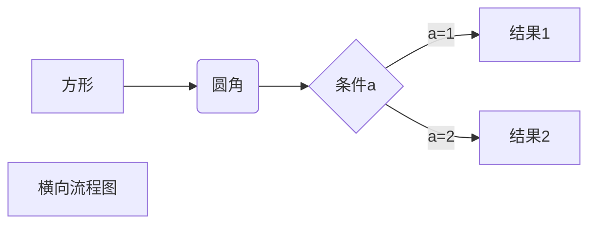
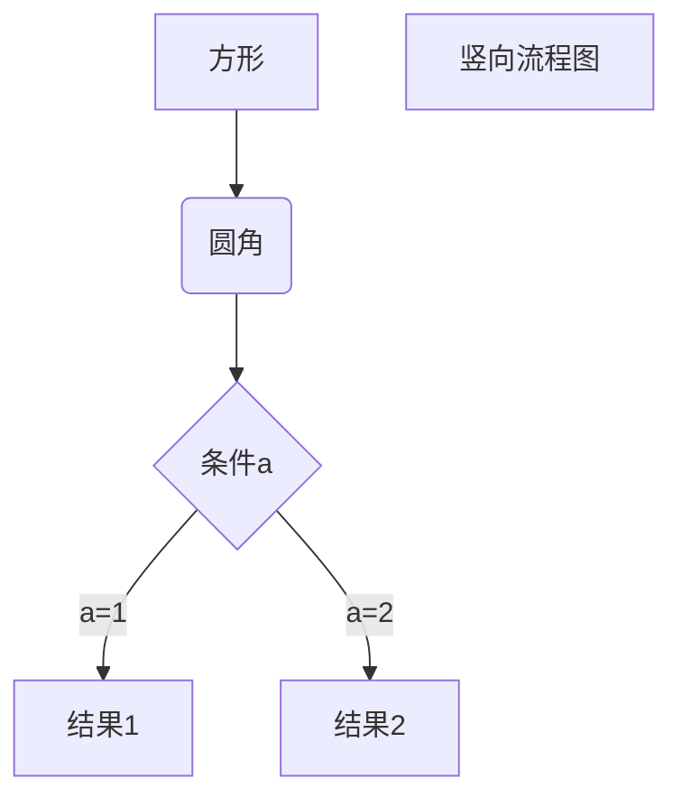
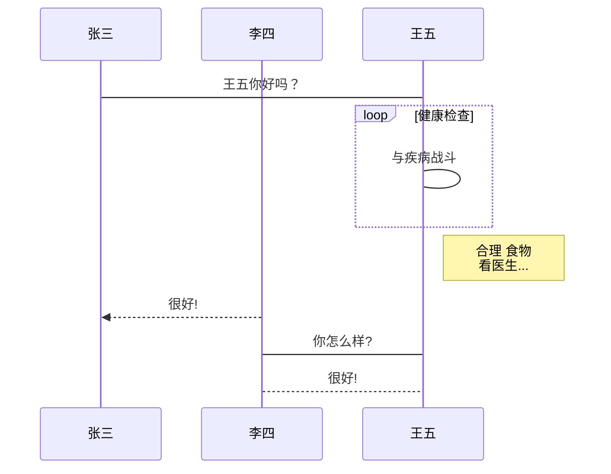
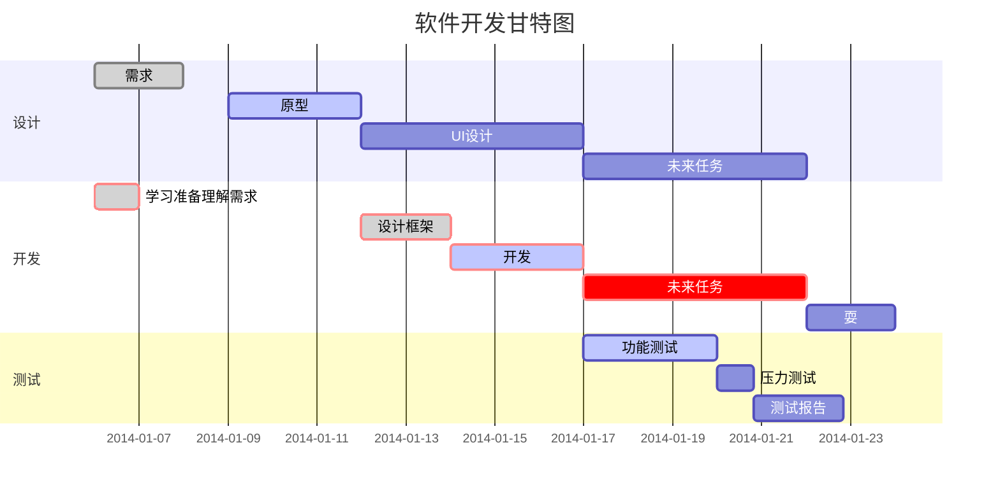

# markdown语法学习

---------------------------

## 1. 标题

```markdown
# 一级标题

## 二级标题

### 三级标题

#### 四级标题

###### 六级标题

####### 七级没有标题
```

-----------------------------

## 2. 段落格式

```
第一个段落
没有开始新段落(和上一行之间隔了一个空格)

可以多空一行来进行新段落

段落末尾加两个空格和回车  

```

*斜体文本*
_斜体文本_
**粗体文本**
__粗体文本__
***粗斜体文本***
___粗斜体文本___

分割线：<kbd>*</kbd> or <kbd>-</kbd> x 3 + <kbd>Enter</kbd>

~~删除线~~

==背景高亮==

<u>带下划线</u>

**文本加粗**

这里有一个问题[^要注明的文本]。

[^要注明的文本]: 注明的内容<br/>换行以后

---

## 3. 列表

* 第一项
* 第二项

1. 第一项
2. 第二项
   - 嵌套元素
     1. 不同的方式


​	首行缩进

> 区块 用 <kbd>></kbd> 键
>
> > + 继续

---

## 4. 区块


```markdown
​```
啦啦啦

还可以设置语言类型(或者markdown格式)
​```
```


---

## 5. 代码

`printf()`函数

```c++
#include <iostream>
int main() {
	std::cout << "Hello World!" << endl;
}
```


---

## 6. 链接

这是一个链接 [菜鸟教程](https://www.runoob.com)

<https://www.runoob.com>

这个链接用 1 作为网址变量 [Google][1]
这个链接用 runoob 作为网址变量 [Runoob][runoob]
然后在文档的结尾为变量赋值（网址）

[1]: http://www.google.com/
[runoob]: http://www.runoob.com/

---

## 7. 图片

```markdown


```


```markdown
这个链接用 1 作为网址变量 [RUNOOB][1].
然后在文档的结尾为变量赋值（网址）

[1]: http://static.runoob.com/images/runoob-logo.png
```

用html的标签


---

## 8. 表格

```markdown
|  表头   | 表头  |
|  ----  | ----  |
| 单元格  | 单元格 |
| 单元格  | 单元格 |

| 左对齐 | 右对齐 | 居中对齐 |
| :-----| ----: | :----: |
| 单元格 | 单元格 | 单元格 |
| 单元格 | 单元格 | 单元格 |
```

|  表头  | 表头2  |
| :----: | :----: |
| 单元格 | 单元格 |


---

## 9. html常用语法

### 1. 对字符串添加标签

<b>b</b>+<kbd>kbd</kbd>+<i>i</i>+<em>em</em>+<sup>sup</sup>+<sub>sub+<br/>换行了

```html
<kbd>框框</kbd>
<b>粗体字</b>
<i>斜体字</i> <!-- 基于物理的样式,没有内容上的意义 -->
<em>斜体字</em> <!-- 强调的意义,基于内容的样式 -->
<sup>上标</sup>
<sub>下标</sub>
<br/>换行
```


\*正常显示星号：用<kbd>\\</kbd>当作转义符


### 2. 修改文字的字体和颜色

- 居中

```html
<center>这一行需要居中</center>
```

<center><font size=3>这一行需要居中</font></center>

- 对齐

```html
<p align="center">居中</p>
<p align="left">左对齐</p>
<p align="right">右对齐</p>
```


- 字体的更换

```html
<font face="黑体">我是黑体字</font>
```

<font face="黑体">我是黑体字</font>

- 大小更改

```html
<font face="黑体" size=5>我是黑体字</font>
```

<font face="黑体" size=5>我是黑体字</font>

- 颜色替换

```html
<font color=red>颜色</font>
```

<font color=red>颜色</font>


---

## 10. 流程图

### **1、横向流程图源码格式：**



### **2、竖向流程图源码格式：**



### **3、标准流程图源码格式：**

```flow
st=>start: 开始框
op=>operation: 处理框
cond=>condition: 判断框(是或否?)
sub1=>subroutine: 子流程
io=>inputoutput: 输入输出框
e=>end: 结束框
st->op->cond
cond(yes)->io->e
cond(no)->sub1(right)->op
```

### **4、标准流程图源码格式（横向）：**

```flow
st=>start: 开始框
op=>operation: 处理框
cond=>condition: 判断框(是或否?)
sub1=>subroutine: 子流程
io=>inputoutput: 输入输出框
e=>end: 结束框
st(right)->op(right)->cond
cond(yes)->io(bottom)->e
cond(no)->sub1(right)->op
```

### **5、UML时序图源码样例：**

```sequence
对象A->对象B: 对象B你好吗?（请求）
Note right of 对象B: 对象B的描述
Note left of 对象A: 对象A的描述(提示)
对象B-->对象A: 我很好(响应)
对象A->对象B: 你真的好吗？
```

### **6、UML时序图源码复杂样例：**

```sequence
Title: 标题：复杂使用
对象A->对象B: 对象B你好吗?（请求）
Note right of 对象B: 对象B的描述
Note left of 对象A: 对象A的描述(提示)
对象B-->对象A: 我很好(响应)
对象B->小三: 你好吗
小三-->>对象A: 对象B找我了
对象A->对象B: 你真的好吗？
Note over 小三,对象B: 我们是朋友
participant C
Note right of C: 没人陪我玩
```

### **7、UML标准时序图样例：**



### **8、甘特图样例：**




## 11. 数学公式

---


#### 行内与独行

1. 行内公式：将公式插入到本行内，符号：`$公式内容$`，如：$xyz$
2. 独行公式：将公式插入到新的一行内，并且居中，符号：`$$公式内容$$`，如：$$xyz$$


#### 上标、下标与组合

1. 上标符号，符号：`^`，如：$x^4$
2. 下标符号，符号：`_`，如：$x_1$
3. 组合符号，符号：`{}`，如：${16}_{8}O{2+}_{2}$


#### 汉字、字体、颜色与格式

1. 汉字形式，符号：`\mbox{}`，如：$V_{\mbox{初始}}$

2. 字体变大，符号：`\displaystyle`，如：$\displaystyle \frac{x+y}{y+z}$

    需注意当宽度达到多行时才有效，不加则保持行距

3. 数学斜体变成罗马体，符号：`\mathrm` or `\rm`，如：$d\ \rm d$

    > 需要正体书写的符号有：
    >
    > 1. 微分符号 $\mathrm{d}$
    > 2. 二项式系数 $\mathrm{C}$
    > 3. 等于号上的 $\mathrm{def}$
    > 4. 自然常数 $\mathrm{e}$
    > 5. 虚数单位 $\mathrm{i}$
    > 6. 

    

4. 字体颜色，符号：`、\textcolor{red/blue/green/black/white/cyan/magenta/yellow}`，如：$x\textcolor{red}yz$

5. 隐藏字体，符号：`\style{visibility:hidden}{sth.}`， 如：$\style{visibility:hidden}{(x+1)(x+1)}$abc

6. 下划线符号，符号：`\underline`，如：$\underline{x+y}$

7. 标签，符号`\tag{数字}`，如：$\tag{11}$

8. 上大括号，符号：`\overbrace{算式}`，如：$\overbrace{a+b+c+d}^{2.0}$

9. 下大括号，符号：`\underbrace{算式}`，如：$a+\underbrace{b+c}_{1.0}+d$

10. 上位符号，符号：`\stacrel{上位符号}{基位符号}`，如：$\vec{x}\stackrel{\mathrm{def}}{=}{x_1,\dots,x_n}$


#### 占位符

1. 两个quad空格，符号：`\qquad`，如：$x \qquad y$
2. quad空格，符号：`\quad`，          如：$x \quad y$
3. 大空格，符号`\`，                           如：$x \  y$
4. 中空格，符号`\:`，                         如：$x \: y$
5. 小空格，符号`\,`，                         如：$x \, y$
6. 没有空格，符号` `，                         如：$xy$
7. 紧贴，符号`\!`，                             如：$x \! y$


#### 定界符与组合

1. 括号，符号：`（）\big(\big) \Big(\Big) \bigg(\bigg) \Bigg(\Bigg)`，如：$（）\big(\big) \Big(\Big) \bigg(\bigg) \Bigg(\Bigg)$

2. 中括号，符号：`[]`，如：$[x+y]$

3. 大括号，符号：`\{ \}`，如：${x+y}$

4. 自适应括号，符号：`\left( \right)`，如：$\left(x\right)$，$\left(x{yz}\right)$

    替换小括号可以变成中括号`[]`或者大括号`\{ \}`，或搭配其它括号使用；后括号不用记得加句号`\right.`

5. 向上取整，符号：`\left\lceil x \right\rceil`，如：$\left\lceil x \right\rceil$

6. 向下取整，符号：`\left\lfloor x \right\rfloor`，如：$\left\lfloor x \right\rfloor$

7. 角括号，符号：`\left\langle \right\rangle`，如：$\left\langle \frac{a}{b} \right\rangle$

8. 斜线与反斜线，符号：`\left / \frac{a}{b} \right \backslash`，如：$\left / \frac{a}{b} \right \backslash$

9. 上下箭头，符号：`\left \uparrow \frac{a}{b} \right \downarrow`，如：$\left \uparrow \frac{a}{b} \right \downarrow$

10. 混合括号，符号：`\left [ 0,1 \right )`，如：$\left [ 0,1 \right )$

11. 组合公式，符号：`{上位公式 \choose 下位公式}`，如：${n+1 \choose k}={n \choose k}+{n \choose k-1}$

12. 组合公式，符号：`{上位公式 \atop 下位公式}`，如：$\sum_{k_0,k_1,\ldots>0 \atop k_0+k_1+\cdots=n}A_{k_0}A_{k_1}\cdots$


#### 四则运算

1. 加法运算，符号：`+`，如：$x+y=z$
2. 减法运算，符号：`-`，如：$x-y=z$
3. 加减运算，符号：`\pm`，如：$x \pm y=z$
4. 减甲运算，符号：`\mp`，如：$x \mp y=z$
5. 乘法运算，符号：`\times`，如：$x \times y=z$
6. 点乘运算，符号：`\cdot`，如：$x \cdot y=z$
7. 星乘运算，符号：`\ast`，如：$x \ast y=z$
8. 除法运算，符号：`\div`，如：$x \div y=z$
9. 斜法运算，符号：`/`，如：$x/y=z$
10. 分式表示，符号：`\frac{分子}{分母}`，如：$\frac{x+y}{y+z}$
11. 分式表示，符号：`\dfrac{分子}{分母}`，等同于`\displaystyle \frac`，如：$\dfrac{x+y}{y+z}$
12. 分式表示，符号：`{分子} \over {分母}`，如：${x+y} \over {y+z}$
13. 绝对值表示，符号：`||`，如：$|x+y|$


#### 高级运算

1. 平均数运算，符号：`\overline{算式}`，如：$\overline{xyz}$

2. 开二次方运算，符号：`\sqrt`，如：$\sqrt x$

3. 开方运算，符号：`\sqrt[开方数]{被开方数}`，如：$\sqrt[3]{x+y}$

4. 对数运算，符号：`\log`，如：$\log(x)$

5. 极限运算，符号：`\lim`，如：$\lim^{x \to \infty}_{y \to 0}{\frac{x}{y}}$

    极限运算，符号：`\displaystyle \lim`，如：$\displaystyle \lim^{x \to \infty}_{y \to 0}{\frac{x}{y}}$

6. 求和运算，符号：`\sum`，如：$\sum^{x \to \infty}_{y \to 0}{\frac{x}{y}}$

    求和运算，符号：`\displaystyle \sum`，如：$\displaystyle \sum^{x \to \infty}_{y \to 0}{\frac{x}{y}}$

7. 连乘运算，符号：`\prod`，如：$\prod_{i=0}^n{1 \over {x^2}}$

    连乘运算，符号：`\displaystyle \prod`，如：$\displaystyle \prod_{i=0}^n{1 \over {x^2}}$

8. 积分运算，符号：`\int`，如：$\int^{\infty}_{0}{xdx}$

    积分运算，符号：`\displaystyle \int`，如：$\displaystyle \int^{\infty}_{0}{xdx}$

9. 二重积分，符号：`\iint`，如：$\displaystyle \iint dx dy$

10. 三重积分，符号：`\iiint`，如：$\displaystyle \iiint dx dy dz$

11. 微分运算，符号：`\mathrm{d}`，如：$\displaystyle \left. \frac{\mathrm{d} x}{\mathrm{d} y} \right|_{x=0}$

12. 二阶微分方程，符号：`d^2`，如：$\displaystyle \frac{\mathrm{d}^2y}{\mathrm{d}x^2}$

13. 偏微分方程，符号：`\partial`，如：$\displaystyle \frac{\partial u}{\partial t}$

14. 分段函数，符号：`\begin{cases} \end{cases}`，如：
    $$
     y=\begin{cases}
     2x+1, & x \leq0\\
     x, & x>0
     \end{cases}
    $$

15. 齐次方程，符号：`\left \{ \begin{array} \end{array} \right.`，如：
    $$
    \left \{ 
     \begin{array}{c}
     a_1x+b_1y+c_1z=d_1 \\ 
     a_2x+b_2y+c_2z=d_2 \\ 
     a_3x+b_3y+c_3z=d_3
     \end{array}
     \right.
    $$

16. 


#### 矩阵和行列式

1. 矩阵表示，符号：`\begin{matrix} \end{matrix}`，如：
    $$
    \left [ \begin{matrix} 
    1 & 2 & \cdots & 4 \\ 
    5 & 6 & \cdots & 8 \\ 
    \vdots & \vdots & \ddots & \vdots \\ 
    13 & 14 & \cdots & 16 
    \end{matrix} \right]
    $$

    > 在起始和结尾处更换`matrix`可以改变括号，如：
    >
    > pmatrix：小括号边框
    >
    > bmatrix：中括号边框
    >
    > Bmatrix：大括号边框
    >
    > vmatrix：单竖线边框
    >
    > Vmatrix：双竖线边框

    

2. 横省略号：`\cdots` 竖省略号：`\vdots` 斜省略号：`\ddots`

3. $m\times n$ 矩阵，如：
    $$
    A=\begin{bmatrix}
    {a_{11}} & {a_{12}} & {\cdots} & {a_{1n}} \\
    {a_{21}} & {a_{22}} & {\cdots} & {a_{2n}} \\
    {\vdots} & {\vdots} & {\ddots} & {\vdots} \\
    {a_{m1}} & {a_{m2}} & {\cdots} & {a_{mn}} \\
    \end{bmatrix}
    $$
    
4. 行列式：
    $$
    D=\begin{vmatrix}
    {a_{11}} & {a_{12}} & {\cdots} & {a_{1n}} \\
    {a_{21}} & {a_{22}} & {\cdots} & {a_{2n}} \\
    {\vdots} & {\vdots} & {\ddots} & {\vdots} \\
    {a_{m1}} & {a_{m2}} & {\cdots} & {a_{mn}} \\
    \end{vmatrix}
    $$
    
5. 增广矩阵，符号`{c c | c}`，放在开头
    $$
    \left[  \begin{array}  {c c | c} 
    1 & 2 & 3 \\
    4 & 5 & 6
    \end{array}  \right]
    $$
    
6. 表格，符号`{c | l l l}`，`c`居中，`l`左对齐，`r`右对齐
    $$
    \begin{array} {c|lll}
    {}&{a}&{b}&{c}    \\
    \hline
    {R_1}&{c}&{b}&{a} \\
    {R_2}&{b}&{c}&{c} \\
    \end{array}
    $$
    
7. 

    

#### 逻辑运算

1. 等于运算，符号：`=`，如：$x+y=z$
2. 大于运算，符号：`>`，如：$x+y>z$
3. 小于运算，符号：`<`，如：$x+y<z$
4. 大于等于运算，符号：`\geq` or `\ge`，如：$x+y \geq z$
5. 小于等于运算，符号：`\leq` or `\le`，如：$x+y \leq z$
6. 不等于运算，符号：`\neq` or `\ne`，如：$x+y \neq z$
7. 不大于等于运算，符号：`\ngeq`，如：$x+y \ngeq z$
8. 不大于等于运算，符号：`\not\ge`，如：$x+y \not\geq z$
9. 不小于等于运算，符号：`\nleq`，如：$x+y \nleq z$
10. 不小于等于运算，符号：`\not\le`，如：$x+y \not\leq z$
11. 约等于运算，符号：`\approx`，如：$x+y \approx z$
12. 恒定等于运算，符号：`\equiv`，如：$x+y \equiv z$


#### 集合运算

1. 属于运算，符号：`\in`，如：$x \in y$
2. 不属于运算，符号：`\notin`，如：$x \notin y$
3. 不属于运算，符号：`\not\in`，如：$x \not\in y$
4. 子集运算，符号：`\subset`，如：$x \subset y$
5. 子集运算，符号：`\supset`，如：$x \supset y$
6. 真子集运算，符号：`\subseteq`，如：$x \subseteq y$
7. 非真子集运算，符号：`\subsetneq`，如：$x \subsetneq y$
8. 真子集运算，符号：`\supseteq`，如：$x \supseteq y$
9. 非真子集运算，符号：`\supsetneq`，如：$x \supsetneq y$
10. 非子集运算，符号：`\not\subset`，如：$x \not\subset y$
11. 非子集运算，符号：`\not\supset`，如：$x \not\supset y$
12. 并集运算，符号：`\cup`，如：$x \cup y$
13. 交集运算，符号：`\cap`，如：$x \cap y$
14. 差集运算，符号：`\setminus`，如：$x \setminus y$
15. 同或运算，符号：`\bigodot`，如：$x \bigodot y$
16. 同与运算，符号：`\bigotimes`，如：$x \bigotimes y$
17. 异或运算，符号：`\bigoplus`，如：$x\bigoplus y$
18. 实数集合，符号：`\mathbb{R}` or just `\R`，如：$\R$
19. 自然数集合，符号：`\mathbb{Z}`，如：$\mathbb{Z}$
20. 空集，符号：`\emptyset`，如：$\emptyset$
21. 


#### 数学符号

1. 无穷，符号：`\infty`，如：$\infty$
2. 虚数，符号：`\imath`，如：$\imath$
3. 虚数，符号：`\jmath`，如：$\jmath$
4. 数学符号，符号`\hat{a}`，如：$\hat{a}$
5. 数学符号，符号`\check{a}`，如：$\check{a}$
6. 数学符号，符号`\breve{a}`，如：$\breve{a}$
7. 数学符号，符号`\tilde{a}`，如：$\tilde{a}$
8. 数学符号，符号`\bar{a}`，如：$\bar{a}$
9. 矢量符号，符号`\vec{a}`，如：$\vec{a}$
10. 数学符号，符号`\acute{a}`，如：$\acute{a}$
11. 数学符号，符号`\grave{a}`，如：$\grave{a}$
12. 数学符号，符号`\mathring{a}`，如：$\mathring{a}$
13. 一阶导数符号，符号`\dot{a}`，如：$\dot{a}$
14. 二阶导数符号，符号`\ddot{a}`，如：$\ddot{a}$
15. 上箭头，符号：`\uparrow`，如：$\uparrow$
16. 上箭头，符号：`\Uparrow`，如：$\Uparrow$
17. 下箭头，符号：`\downarrow`，如：$\downarrow$
18. 下箭头，符号：`\Downarrow`，如：$\Downarrow$
19. 左箭头，符号：`\leftarrow`，如：$\leftarrow$
20. 左箭头，符号：`\Leftarrow`，如：$\Leftarrow$
21. 右箭头，符号：`\rightarrow`，如：$\rightarrow$
22. 右箭头，符号：`\Rightarrow`，如：$\Rightarrow$
23. `\implies`, $\implies$
24. If and only if, `\iff`, $\iff$
25. Exists, `\exist` or `\exists`, $\exist$
26. For all, `\forall`, $\forall$
27. `\ll`, $\ll$
28. `\gg`, $\gg$
29. 底端对齐的省略号，符号：`\ldots`，如：$1,2,\ldots,n$
30. 中线对齐的省略号，符号：`\cdots`，如：$x_1^2 + x_2^2 + \cdots + x_n^2$
31. 竖直对齐的省略号，符号：`\vdots`，如：$\vdots$
32. 斜对齐的省略号，符号：`\ddots`，如：$\ddots$


#### 希腊字母

| 字母 | 实现       | 字母 | 实现       |
| ---- | ---------- | ---- | ---------- |
| A    | `A`        | α    | `\alpha`   |
| B    | `B`        | β    | `\beta`    |
| Γ    | `\Gamma`   | γ    | `\gamma`   |
| Δ    | `\Delta`   | δ    | `\delta`   |
| E    | `E`        | ϵ    | `\epsilon` |
| Z    | `Z`        | ζ    | `\zeta`    |
| H    | `H`        | η    | `\eta`     |
| Θ    | `\Theta`   | θ    | `\theta`   |
| I    | `I`        | ι    | `\iota`    |
| K    | `K`        | κ    | `\kappa`   |
| Λ    | `\Lambda`  | λ    | `\lambda`  |
| M    | `M`        | μ    | `\mu`      |
| N    | `N`        | ν    | `\nu`      |
| Ξ    | `\Xi`      | ξ    | `\xi`      |
| O    | `O`        | ο    | `\omicron` |
| Π    | `\Pi`      | π    | `\pi`      |
| P    | `P`        | ρ    | `\rho`     |
| Σ    | `\Sigma`   | σ    | `\sigma`   |
| T    | `T`        | τ    | `\tau`     |
| Υ    | `\Upsilon` | υ    | `\upsilon` |
| Φ    | `\Phi`     | ϕ    | `\phi`     |
| X    | `X`        | χ    | `\chi`     |
| Ψ    | `\Psi`     | ψ    | `\psi`     |
| Ω    | `\v`       | ω    | `\omega`   |


---


